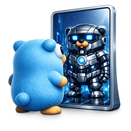

# go-ai



[](https://pkg.go.dev/github.com/rcarmo/go-ai)
[](https://github.com/rcarmo/go-ai/actions/workflows/ci.yml)
[](LICENSE)

A Go port of [@mariozechner/pi-ai](https://www.npmjs.com/package/@mariozechner/pi-ai) — unified LLM API with automatic model discovery, streaming, tool calling, and multi-provider support.

> **⚠️ Experimental.** This module is still at `v0` and tracks the TypeScript original closely.
> The API surface may change before `v1`. Use in production at your own risk.

## Documentation

- [Go Reference](https://pkg.go.dev/github.com/rcarmo/go-ai) — published API documentation for the module.
- [Source repository](https://github.com/rcarmo/go-ai) — issues, releases, CI status, and source history.
- [Basic usage](docs/basic-usage.md) — getting started with streaming and completion calls.
- [Model selection](docs/model-selection.md) — built-in registry and provider/model lookup.
- [Prompt and context handling](docs/prompts-and-context.md) — message shapes, context, and serialization.
- [Tool calling](docs/tool-calling.md) — tool definitions, tool-call events, and tool results.
- [Image handling](docs/image-handling.md) — multimodal inputs and provider support.
- [Harness helpers](docs/HARNESS.md) — higher-level agent/session helpers.

## Why

I needed a Go library for talking to LLMs that was at least as good as
[pi-ai](https://www.npmjs.com/package/@mariozechner/pi-ai) — unified
streaming, tool calling, multi-provider, proper cost tracking — and couldn't
find anything I liked. Everything was either OpenAI-only, didn't stream
properly, or required pulling in half the internet as dependencies.

So I ported pi-ai to Go. Same types (JSON-serialization-compatible), same
event protocol, same provider coverage. If you know pi-ai, you know this.

## Credits

This project is a derivative work of
[**@mariozechner/pi-ai**](https://www.npmjs.com/package/@mariozechner/pi-ai) by
[Mario Zechner](https://mariozechner.at). The type system, event
protocol, provider implementations, model registry, and OAuth flows are all
ported from his TypeScript library. All credit for the design goes to him.

## Features

- **Unified API** — same `Stream()`/`Complete()` interface across all providers
- **Streaming** — channel-based event stream with text, thinking, and tool call deltas
- **Tool calling** — typed tool definitions with JSON Schema parameters
- **Multi-provider** — OpenAI, Anthropic, Google, Mistral, Bedrock, and OpenAI-compatible APIs
- **Context serialization** — JSON-compatible with pi-ai for cross-language hand-off
- **Cost tracking** — per-request token counts and USD cost breakdown
- **Thinking/reasoning** — unified thinking level across providers

## Quick start

```go
package main

import (
    "context"
    "fmt"
    "log"

    goai "github.com/rcarmo/go-ai"
    _ "github.com/rcarmo/go-ai/provider/openairesponses" // register OpenAI Responses
    _ "github.com/rcarmo/go-ai/provider/anthropic"       // register Anthropic
)

func main() {
    goai.RegisterBuiltinModels()

    // Built-in gpt-4o-mini uses the OpenAI Responses provider.
    model := goai.GetModel(goai.ProviderOpenAI, "gpt-4o-mini")

    ctx := &goai.Context{
        SystemPrompt: "You are a helpful assistant.",
        Messages: []goai.Message{
            goai.UserMessage("What is 2+2?"),
        },
    }

    // Streaming
    events := goai.Stream(context.Background(), model, ctx, nil)
    for event := range events {
        switch e := event.(type) {
        case *goai.TextDeltaEvent:
            fmt.Print(e.Delta)
        case *goai.DoneEvent:
            fmt.Printf("\n\nTokens: %d in, %d out ($%.6f)\n",
                e.Message.Usage.Input, e.Message.Usage.Output, e.Message.Usage.Cost.Total)
        case *goai.ErrorEvent:
            log.Fatal(e.Err)
        }
    }
}
```

## Architecture

```
go-ai/
│
├── types.go             # Message, Context, Tool, Model, Usage, StreamOptions
├── events.go            # Stream event types (12 event kinds)
├── registry.go          # Stream(), Complete(), provider + model registry
├── context.go           # Overflow detection, tool call validation
├── transform.go         # Cross-provider message normalization
├── harness.go           # Agent helpers: clone, save/load, compact, hooks
├── env.go               # API key resolution for known providers
├── compat.go            # OpenAI-compatible provider compatibility flags
├── retry.go             # Exponential backoff with configurable limits
├── logger.go            # Pluggable leveled logging (zero-cost default)
├── azure.go             # Azure tool-call trimming + reasoning normalization
├── simple_options.go    # Thinking level mapping, cost calculation
├── utils.go             # Hash, sanitize, Copilot headers
├── models_generated.go  # 956 models / 28 providers (auto-generated)
├── doc.go               # Package documentation
│
├── provider/            # LLM provider implementations (blank-import to register)
│   ├── openai/          # OpenAI Chat Completions + compatible APIs
│   ├── anthropic/       # Anthropic Messages API
│   ├── openairesponses/ # OpenAI Responses API + Azure OpenAI
│   ├── openaicodex/     # OpenAI Codex (WebSocket + SSE)
│   ├── google/          # Google Generative AI + Vertex AI
│   ├── geminicli/       # Google Gemini CLI (Cloud Code Assist)
│   ├── mistral/         # Mistral Conversations API
│   ├── bedrock/         # Amazon Bedrock ConverseStream
│   └── faux/            # Test double for unit testing
│
├── oauth/               # OAuth flows (import when needed)
│   ├── oauth.go         # Framework + PKCE
│   ├── github_copilot.go
│   ├── anthropic.go
│   ├── google_gemini_cli.go
│   ├── google_antigravity.go
│   └── openai_codex.go
│
├── internal/            # Private implementation details
│   ├── eventstream/     # SSE line parser
│   └── jsonparse/       # Partial JSON for streaming tool args
│
├── examples/            # Runnable usage examples
│   ├── basic/           # Non-streaming completion
│   ├── streaming/       # Real-time text output
│   └── tools/           # Agent loop with tool calling
│
├── scripts/             # Build and maintenance tooling
│   ├── generate-models.go   # Model registry code generator (pure Go)
│   └── check-logging.sh     # Logging quality gate
│
└── docs/                # Documentation
    ├── basic-usage.md
    ├── model-selection.md
    ├── prompts-and-context.md
    ├── tool-calling.md
    ├── image-handling.md
    ├── context-hooks.md
    ├── HARNESS.md
    └── SKILL.md
```

## Provider status

| Provider | API | Status |
|---|---|---|
| OpenAI | `openai-completions` | ✅ Implemented |
| Anthropic | `anthropic-messages` | ✅ Implemented |
| OpenAI Responses | `openai-responses` | ✅ Implemented |
| Azure OpenAI | `azure-openai-responses` | ✅ Implemented |
| Google Generative AI | `google-generative-ai` | ✅ Implemented |
| Google Vertex AI | `google-vertex` | ✅ Implemented |
| Mistral | `mistral-conversations` | ✅ Implemented |
| Amazon Bedrock | `bedrock-converse-stream` | ✅ Implemented |
| Google Gemini CLI | `google-gemini-cli` | ✅ Implemented |
| OpenAI Codex | `openai-codex-responses` | ✅ Implemented |
| Cloudflare Workers AI / AI Gateway | `openai-completions`, `openai-responses`, `anthropic-messages` | ✅ Implemented |
| Moonshot AI | `openai-completions` | ✅ Implemented |
| Any OpenAI-compatible | `openai-completions` | ✅ Via OpenAI provider |

## OAuth

| Provider | Status |
|---|---|
| GitHub Copilot (device flow) | ✅ Implemented |
| Google Gemini CLI (auth code + PKCE) | ✅ Implemented |
| Anthropic (auth code + PKCE) | ✅ Implemented |
| OpenAI Codex (device flow) | ✅ Implemented |
| Antigravity | 🔲 Planned |

## Compatibility with pi-ai

Types are designed to be JSON-serialization-compatible with pi-ai's TypeScript types. A `Context` serialized in Go can be deserialized in TypeScript and vice versa, enabling:

- Cross-language agent hand-off
- Shared conversation logs
- Mixed Go/TypeScript tool pipelines

## Environment variables

API keys are resolved in order: explicit option → model config → environment variable.

## Retries

Retries are opt-in per request. By default, providers do not retry.

```go
opts := &goai.StreamOptions{
    RetryConfig: &goai.RetryConfig{
        MaxRetries:        2,
        InitialDelay:      500 * time.Millisecond,
        MaxDelay:          5 * time.Second,
        BackoffMultiplier: 2.0,
    },
}
```

Providers using HTTP now honor `RetryConfig` directly. `MaxRetryDelayMs` remains as a legacy shorthand.

## Notes

- Import the provider that matches `model.Api`, not just `model.Provider`.
  For example, built-in `gpt-4o-mini` currently uses `openai-responses`, so import `provider/openairesponses`.
- `CompactContext()` is simple tail truncation. If you need summaries or tool-pair preservation, build a custom compactor in your harness.

| Provider | Environment Variable |
|---|---|
| OpenAI | `OPENAI_API_KEY` |
| Anthropic | `ANTHROPIC_API_KEY` |
| Google | `GEMINI_API_KEY` |
| Mistral | `MISTRAL_API_KEY` |
| xAI | `XAI_API_KEY` |
| Groq | `GROQ_API_KEY` |

## License

MIT
