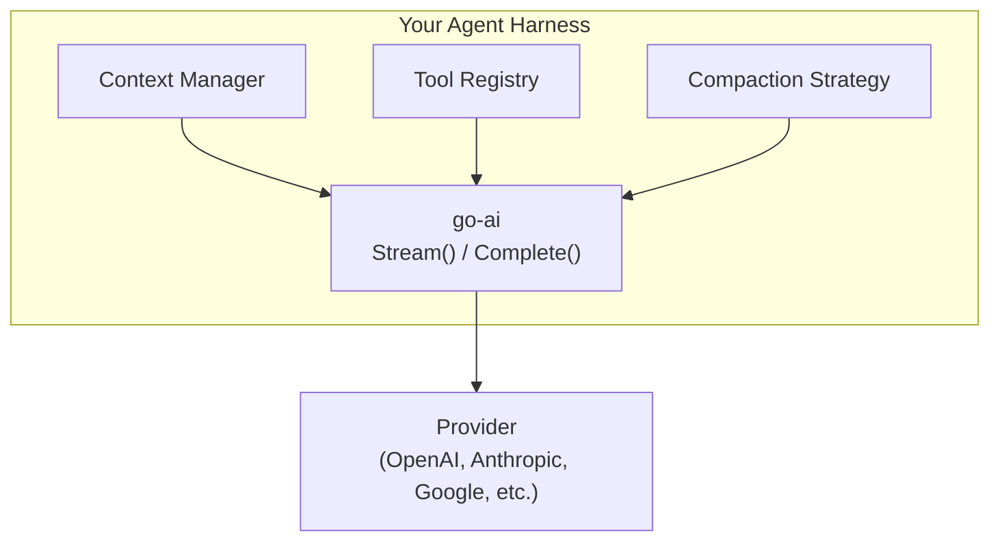

# Building Agent Harnesses with go-ai

This guide covers how to use go-ai as the LLM layer for a custom coding
agent, chatbot, or automation pipeline.

## Table of contents

- [Architecture overview](#architecture-overview)
- [Basic agent loop](#basic-agent-loop)
- [Context management](#context-management)
- [Tool calling](#tool-calling)
- [Context compaction](#context-compaction)
- [Retry and overflow handling](#retry-and-overflow-handling)
- [Session management](#session-management)
- [Request/response hooks](#requestresponse-hooks)
- [Logging and observability](#logging-and-observability)
- [Cross-provider hand-off](#cross-provider-hand-off)
- [Testing with the faux provider](#testing-with-the-faux-provider)

---

## Architecture overview



go-ai handles:
- Provider selection and API calls
- Streaming with event protocol
- Message format conversion
- Token/cost tracking
- HTTP retry execution when `StreamOptions.RetryConfig` is set
- Overflow detection

Your harness handles:
- Conversation state
- Tool definition and execution
- Context window management / compaction
- Session persistence
- User interface

---

## Basic agent loop

```go
package main

import (
    "context"
    "fmt"
    "log"

    goai "github.com/rcarmo/go-ai"
    _ "github.com/rcarmo/go-ai/provider/openairesponses"
    _ "github.com/rcarmo/go-ai/provider/anthropic"
)

func main() {
    goai.RegisterBuiltinModels()
    model := goai.GetModel(goai.ProviderOpenAI, "gpt-4o-mini")

    ctx := &goai.Context{
        SystemPrompt: "You are a helpful coding assistant.",
        Messages:     []goai.Message{goai.UserMessage("Write a hello world in Go")},
        Tools:        myTools,
    }

    for {
        msg, err := goai.Complete(context.Background(), model, ctx, nil)
        if err != nil {
            log.Fatal(err)
        }

        // Add assistant response to context
        goai.AppendAssistantMessage(ctx, msg)

        // Check if we need to execute tools
        if !goai.NeedsToolExecution(msg) {
            fmt.Println(goai.GetTextContent(msg))
            break
        }

        // Execute tools
        for _, tc := range goai.GetToolCalls(msg) {
            result := executeMyTool(tc)
            goai.AppendToolResult(ctx, tc.ID, tc.Name, result, false)
        }

        // Loop back for next LLM turn
    }
}
```

---

## Context management

### Creating and cloning contexts

```go
// Create
ctx := &goai.Context{
    SystemPrompt: "You are helpful.",
    Messages:     []goai.Message{goai.UserMessage("hi")},
    Tools:        tools,
}

// Deep clone (safe for concurrent modification)
snapshot := goai.CloneContext(ctx)

// Save to disk
goai.SaveContext(ctx, "session.json")

// Load from disk
restored, _ := goai.LoadContext("session.json")
```

### Building conversations

```go
// Add messages
goai.AppendUserMessage(ctx, "What is 2+2?")

// Add tool results after executing a tool call
goai.AppendToolResult(ctx, toolCall.ID, toolCall.Name, "result text", false)

// Add a completed assistant message
goai.AppendAssistantMessage(ctx, assistantMsg)
```

### Inspecting messages

```go
// Get all tool calls from an assistant message
calls := goai.GetToolCalls(msg)

// Get concatenated text content
text := goai.GetTextContent(msg)

// Check if tool execution is needed
if goai.NeedsToolExecution(msg) {
    // execute tools...
}
```

---

## Tool calling

```go
tools := []goai.Tool{
    {
        Name:        "read_file",
        Description: "Read a file from the filesystem",
        Parameters:  json.RawMessage(`{
            "type": "object",
            "properties": {
                "path": {"type": "string", "description": "File path to read"}
            },
            "required": ["path"]
        }`),
    },
}

// Validate tool call arguments against the schema
args, err := goai.ValidateToolCall(tools, toolCall)
```

---

## Context compaction

When conversations grow beyond the model's context window, you need to compact.

### Simple compaction (keep recent messages)

```go
// Check if context fits
fits, tokens := goai.FitsInContextWindow(ctx, model)
if !fits {
    ctx = goai.CompactContext(ctx, model, 20) // keep last 20 messages
}
```

### Custom compaction with summarization

```go
func compactWithSummary(ctx *goai.Context, model *goai.Model) *goai.Context {
    fits, _ := goai.FitsInContextWindow(ctx, model)
    if fits {
        return ctx
    }

    clone := goai.CloneContext(ctx)

    // Split into old and recent
    splitAt := len(clone.Messages) - 20
    if splitAt <= 0 {
        return clone
    }

    old := clone.Messages[:splitAt]
    recent := clone.Messages[splitAt:]

    // Summarize old messages (using the same model or a cheaper one)
    summary := summarizeMessages(old) // your implementation

    // Replace old messages with summary
    clone.Messages = append(
        []goai.Message{goai.UserMessage("Previous conversation summary: " + summary)},
        recent...,
    )

    return clone
}
```

### Token estimation

```go
tokens := goai.EstimateTokens(ctx) // rough ~4 chars/token estimate
```

For precise token counts, use a provider-specific tokenizer (e.g., tiktoken for OpenAI).

---

## Retry and overflow handling

### Overflow detection

```go
msg, err := goai.Complete(ctx, model, convCtx, opts)
if err != nil && goai.IsContextOverflow(msg, model.ContextWindow) {
    // Context too large — compact and retry
    convCtx = goai.CompactContext(convCtx, model, 10)
    msg, err = goai.Complete(ctx, model, convCtx, opts)
}
```

### Provider-level retries

HTTP-based providers honor `StreamOptions.RetryConfig` directly:

```go
opts := &goai.StreamOptions{
    RetryConfig: &goai.RetryConfig{
        MaxRetries:        2,
        InitialDelay:      500 * time.Millisecond,
        MaxDelay:          5 * time.Second,
        BackoffMultiplier: 2.0,
    },
}

msg, err := goai.Complete(ctx, model, convCtx, opts)
```

Retries are disabled by default. When enabled, the final HTTP response is still returned to the provider layer after retry exhaustion so the provider can surface the real status/body.

### Custom outer retry loop

Use an outer loop only for harness-level decisions like compaction, model switching, or policy changes:

```go
func completeWithRetry(ctx context.Context, model *goai.Model, convCtx *goai.Context, opts *goai.StreamOptions, maxRetries int) (*goai.Message, error) {
    var lastErr error
    for attempt := 0; attempt <= maxRetries; attempt++ {
        msg, err := goai.Complete(ctx, model, convCtx, opts)
        if err == nil {
            return msg, nil
        }
        if msg != nil && goai.IsContextOverflow(msg, model.ContextWindow) {
            convCtx = goai.CompactContext(convCtx, model, 20)
            continue
        }
        lastErr = err
        time.Sleep(time.Duration(attempt+1) * time.Second)
    }
    return nil, lastErr
}
```

---

## Session management

### Session ID for prompt caching

```go
opts := &goai.StreamOptions{
    SessionID: "session-" + uuid.New().String(),
    CacheRetention: goai.CacheRetentionShort,
}

// Subsequent requests with the same SessionID may benefit from
// server-side prompt caching (provider-dependent)
```

### Persisting sessions

```go
// Save after each turn
goai.SaveContext(ctx, fmt.Sprintf("sessions/%s.json", sessionID))

// Restore on reconnect
ctx, err := goai.LoadContext(fmt.Sprintf("sessions/%s.json", sessionID))
```

---

## Request/response hooks

Hooks let you intercept requests and responses for logging, modification,
metrics, or compliance.

### Inspecting payloads

```go
opts := &goai.StreamOptions{
    OnPayload: func(payload interface{}, model *goai.Model) (interface{}, error) {
        // Log the outgoing request
        data, _ := json.MarshalIndent(payload, "", "  ")
        log.Printf("Request to %s/%s:\n%s", model.Provider, model.ID, data)
        return nil, nil // nil = keep original payload
    },
    OnResponse: func(status int, headers map[string]string, model *goai.Model) {
        // Track rate limit headers
        remaining := headers["X-Ratelimit-Remaining"]
        log.Printf("Response %d from %s (remaining: %s)", status, model.Provider, remaining)
    },
}
```

### Modifying payloads

```go
opts := &goai.StreamOptions{
    OnPayload: func(payload interface{}, model *goai.Model) (interface{}, error) {
        // Inject custom fields for specific providers
        if m, ok := payload.(map[string]interface{}); ok {
            m["store"] = true
            m["metadata"] = map[string]string{"user_id": "u123"}
            return m, nil
        }
        return nil, nil
    },
}
```

---

## Logging and observability

### Enable logging

```go
// Stderr at info level
goai.SetLogger(goai.NewStderrLogger(goai.LogLevelInfo))

// Custom writer at debug level
goai.SetLogger(goai.NewSimpleLogger(logFile, goai.LogLevelDebug))

// Bring your own logger (slog, zerolog, zap, etc.)
goai.SetLogger(myAdapter)
```

### What's logged

| Level | Event |
|---|---|
| Debug | Stream start (provider, model, message count) |
| Debug | HTTP request URL |
| Debug | Request aborted |
| Info | Complete done (stop reason, token counts) |
| Warn | HTTP error response |
| Warn | Network error |
| Warn | Retryable status with backoff delay |
| Error | Complete error |
| Error | Missing provider |

### Custom logger adapter

```go
type slogAdapter struct{ logger *slog.Logger }

func (a *slogAdapter) Debug(msg string, kv ...interface{}) {
    a.logger.Debug(msg, kv...)
}
func (a *slogAdapter) Info(msg string, kv ...interface{})  { a.logger.Info(msg, kv...) }
func (a *slogAdapter) Warn(msg string, kv ...interface{})  { a.logger.Warn(msg, kv...) }
func (a *slogAdapter) Error(msg string, kv ...interface{}) { a.logger.Error(msg, kv...) }
```

---

## Cross-provider hand-off

Contexts are JSON-serialization-compatible with pi-ai (TypeScript).
You can hand off a conversation between Go and TypeScript agents,
or switch providers mid-conversation.

### Switching providers

```go
// Start with a fast model
model1 := goai.GetModel(goai.ProviderOpenAI, "gpt-4o-mini") // OpenAI Responses
msg1, _ := goai.Complete(ctx, model1, convCtx, nil)
goai.AppendAssistantMessage(convCtx, msg1)

// Switch to a stronger model for complex reasoning
model2 := goai.GetModel(goai.ProviderAnthropic, "claude-sonnet-4-20250514")
msg2, _ := goai.Complete(ctx, model2, convCtx, nil)
```

go-ai's `TransformMessages()` automatically handles cross-provider
differences (thinking blocks, tool call ID formats, image support). It also:
- drops errored/aborted assistant messages
- inserts synthetic errored tool results for orphaned tool calls
- downgrades unsupported images to text placeholders

At debug level, these transformations are logged with counts.

### Cross-language hand-off

```go
// Go → TypeScript: save context as JSON
goai.SaveContext(convCtx, "handoff.json")

// TypeScript → Go: load context from JSON
ctx, _ := goai.LoadContext("handoff.json")
```

The JSON format is identical to pi-ai's `Context` type.

---

## Testing with the faux provider

```go
import "github.com/rcarmo/go-ai/provider/faux"

func TestMyAgent(t *testing.T) {
    reg := faux.Register(nil)
    reg.SetResponses([]faux.ResponseStep{
        faux.TextMessage("I'll search for that."),
        faux.ToolCallMessage("search", map[string]interface{}{"q": "test"}),
        faux.TextMessage("Here are the results: ..."),
    })

    model := reg.GetModel()
    // ... run your agent loop against the faux model
}

// Dynamic responses based on context
reg.SetResponses([]faux.ResponseStep{
    faux.ResponseFactory(func(ctx *goai.Context, opts *goai.StreamOptions, state *faux.State) *goai.Message {
        // Inspect context and return appropriate response
        if len(ctx.Messages) > 5 {
            return faux.TextMessage("Conversation is getting long!")
        }
        return faux.TextMessage("Short response")
    }),
})
```
