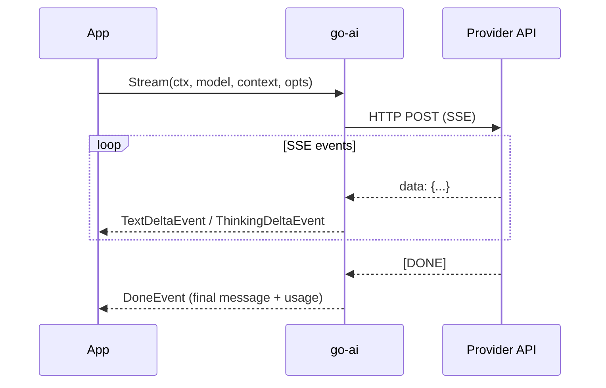

# Basic Usage

## Installation

```bash
go get github.com/rcarmo/go-ai@latest
```

## Imports

go-ai uses blank imports to register providers. Import only the providers you need:

```go
import (
    goai "github.com/rcarmo/go-ai"

    // Register the providers you want to use
    _ "github.com/rcarmo/go-ai/provider/openai"         // OpenAI + compatible APIs
    _ "github.com/rcarmo/go-ai/provider/anthropic"       // Anthropic Claude
    _ "github.com/rcarmo/go-ai/provider/google"          // Google Gemini + Vertex AI
    _ "github.com/rcarmo/go-ai/provider/mistral"         // Mistral
    _ "github.com/rcarmo/go-ai/provider/bedrock"         // Amazon Bedrock
    _ "github.com/rcarmo/go-ai/provider/openairesponses" // OpenAI Responses API + Azure
    _ "github.com/rcarmo/go-ai/provider/geminicli"       // Google Gemini CLI
    _ "github.com/rcarmo/go-ai/provider/openaicodex"     // OpenAI Codex (WebSocket)
)
```

Each blank import calls `init()` which registers that provider's streaming implementation. Unused providers are never loaded.

## API keys

API keys are resolved in order:

1. `StreamOptions.APIKey` (per-request)
2. `Model.APIKey` (per-model)
3. Environment variable (per-provider)

| Provider | Environment variable |
|---|---|
| OpenAI | `OPENAI_API_KEY` |
| Anthropic | `ANTHROPIC_API_KEY` (or `ANTHROPIC_OAUTH_TOKEN`) |
| Google | `GEMINI_API_KEY` |
| Mistral | `MISTRAL_API_KEY` |
| xAI | `XAI_API_KEY` |
| Groq | `GROQ_API_KEY` |
| Cerebras | `CEREBRAS_API_KEY` |
| OpenRouter | `OPENROUTER_API_KEY` |
| Amazon Bedrock | AWS credentials (profile, env vars, or IRSA) |

## First request — non-streaming

```go
goai.RegisterBuiltinModels() // load 865 built-in models

model := goai.GetModel(goai.ProviderOpenAI, "gpt-4o-mini")

ctx := &goai.Context{
    SystemPrompt: "You are a helpful assistant.",
    Messages:     []goai.Message{goai.UserMessage("Hello!")},
}

msg, err := goai.Complete(context.Background(), model, ctx, nil)
if err != nil {
    log.Fatal(err)
}

fmt.Println(goai.GetTextContent(msg))
fmt.Printf("Tokens: %d in, %d out ($%.6f)\n",
    msg.Usage.Input, msg.Usage.Output, msg.Usage.Cost.Total)
```

`Complete()` blocks until the full response is received. It internally streams and collects events.

## Streaming

```go
events := goai.Stream(context.Background(), model, ctx, nil)
for event := range events {
    switch e := event.(type) {
    case *goai.TextDeltaEvent:
        fmt.Print(e.Delta) // print tokens as they arrive
    case *goai.DoneEvent:
        // final message with usage/cost
        fmt.Printf("\n($%.6f)\n", e.Message.Usage.Cost.Total)
    case *goai.ErrorEvent:
        log.Fatal(e.Err)
    }
}
```

`Stream()` returns a `<-chan Event`. Read all events until the channel closes. The last event is always `DoneEvent` (success) or `ErrorEvent` (failure).




## Event types

| Event | When |
|---|---|
| `StartEvent` | Stream begins |
| `TextStartEvent` | New text block opens |
| `TextDeltaEvent` | Incremental text chunk |
| `TextEndEvent` | Text block closes |
| `ThinkingStartEvent` | Reasoning block opens |
| `ThinkingDeltaEvent` | Incremental thinking chunk |
| `ThinkingEndEvent` | Reasoning block closes |
| `ToolCallStartEvent` | Tool call begins |
| `ToolCallDeltaEvent` | Incremental tool argument JSON |
| `ToolCallEndEvent` | Tool call complete with parsed arguments |
| `DoneEvent` | Success — final message with usage |
| `ErrorEvent` | Failure — error details |

## Aborting requests

Use `context.WithCancel` or `context.WithTimeout`:

```go
ctx, cancel := context.WithTimeout(context.Background(), 30*time.Second)
defer cancel()

msg, err := goai.Complete(ctx, model, convCtx, nil)
if err != nil {
    // err may be context.DeadlineExceeded or context.Canceled
}
```

## Logging

```go
// Enable info-level logging to stderr
goai.SetLogger(goai.NewStderrLogger(goai.LogLevelInfo))

// Or debug for full request/response logging
goai.SetLogger(goai.NewStderrLogger(goai.LogLevelDebug))

// Disable (default)
goai.SetLogger(nil)
```
