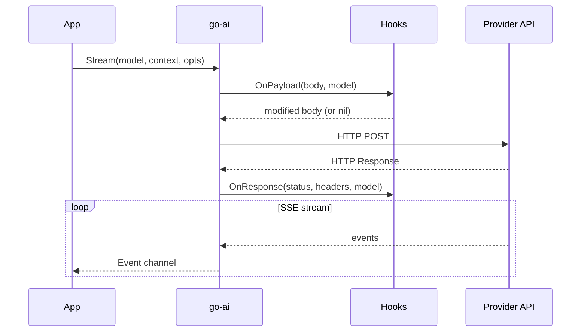

# Context Hooks

Hooks let you intercept, inspect, and modify requests and responses at the provider boundary. Use them for logging, metrics, compliance, payload modification, and session management.




## OnPayload — inspect or modify outgoing requests

Called with the provider request payload before it's sent. Return a modified payload to replace it, or `nil` to keep the original.

All real HTTP providers wire `OnPayload` now, including OpenAI, Anthropic, OpenAI Responses/Azure, Google, Mistral, Gemini CLI, and OpenAI Codex SSE.

```go
opts := &goai.StreamOptions{
    OnPayload: func(payload interface{}, model *goai.Model) (interface{}, error) {
        // Log the request
        data, _ := json.MarshalIndent(payload, "", "  ")
        log.Printf("[%s/%s] Request:\n%s", model.Provider, model.ID, data)
        return nil, nil // keep original
    },
}
```

### Modifying payloads

Provider payloads are usually typed structs, not generic maps. A safe pattern is to round-trip through JSON before editing:

```go
opts := &goai.StreamOptions{
    OnPayload: func(payload interface{}, model *goai.Model) (interface{}, error) {
        var m map[string]interface{}
        data, err := json.Marshal(payload)
        if err != nil {
            return nil, err
        }
        if err := json.Unmarshal(data, &m); err != nil {
            return nil, err
        }

        m["metadata"] = map[string]string{"user_id": currentUser.ID}
        if model.Provider == goai.ProviderOpenAI {
            m["store"] = true
        }
        return m, nil
    },
}
```

### Error handling

Returning an error from OnPayload aborts the request:

```go
OnPayload: func(payload interface{}, model *goai.Model) (interface{}, error) {
    if isBlocked(model.ID) {
        return nil, fmt.Errorf("model %s is blocked by policy", model.ID)
    }
    return nil, nil
},
```

## OnResponse — inspect response headers

Called after the HTTP response is received, before the body stream is consumed. Use for rate limit tracking, request ID logging, and metrics.

```go
opts := &goai.StreamOptions{
    OnResponse: func(status int, headers map[string]string, model *goai.Model) {
        // Track rate limits
        remaining := headers["X-Ratelimit-Remaining-Requests"]
        resetAt := headers["X-Ratelimit-Reset-Requests"]
        log.Printf("[%s] Rate limit: %s remaining, reset in %s",
            model.Provider, remaining, resetAt)

        // Log request ID for debugging
        if reqID := headers["X-Request-Id"]; reqID != "" {
            log.Printf("[%s] Request ID: %s", model.Provider, reqID)
        }
    },
}
```

## Session management

### Session ID for prompt caching

Some providers cache prompts server-side when requests share a session ID:

```go
opts := &goai.StreamOptions{
    SessionID:      "session-" + uuid.New().String(),
    CacheRetention: goai.CacheRetentionShort, // "none", "short", "long"
}
```

### Session affinity headers

For OpenAI-compatible providers that support session routing:

```go
// Auto-detected from compat flags
opts := &goai.StreamOptions{
    SessionID: mySessionID,
    // Headers are added automatically if the provider supports session affinity
}
```

### Azure-specific session headers

For Azure OpenAI Responses, these headers are applied automatically when `SessionID` is set:

```go
headers := goai.AzureSessionHeaders(sessionID)
// Returns: session_id, x-client-request-id, x-ms-client-request-id
```

## Retries

Retries are opt-in and configured per request:

```go
opts := &goai.StreamOptions{
    RetryConfig: &goai.RetryConfig{
        MaxRetries:        2,
        InitialDelay:      500 * time.Millisecond,
        MaxDelay:          5 * time.Second,
        BackoffMultiplier: 2.0,
    },
}
```

`MaxRetryDelayMs` remains as a legacy shorthand if you only want to cap `Retry-After`.

## Reconnect / recovery pattern

Retries cover initial HTTP setup and retryable HTTP responses. For long-lived SSE or WebSocket streams, callers should still handle mid-stream failure explicitly.

SSE-based providers now surface read failures as `ErrorEvent` instead of silently ending the stream.

```go
for {
    events := goai.Stream(ctx, model, convCtx, opts)
    var done bool
    for event := range events {
        switch e := event.(type) {
        case *goai.TextDeltaEvent:
            fmt.Print(e.Delta)
        case *goai.DoneEvent:
            done = true
        case *goai.ErrorEvent:
            // Persist context/checkpoint here, then decide whether to reconnect.
            log.Printf("stream failed: %v", e.Err)
        }
    }
    if done {
        break
    }
    // Reconnect policy is harness-specific: backoff, resume from saved context,
    // switch transports/providers, or abort.
    time.Sleep(time.Second)
}
```

For WebSocket transports, use the same outer-loop pattern. `RetryConfig` helps with initial connection setup, while the outer loop handles mid-stream reconnect decisions.

## Context compaction hooks

For agent harnesses that need to compact context before each LLM call:

```go
func compactBeforeCall(ctx *goai.Context, model *goai.Model) *goai.Context {
    fits, tokens := goai.FitsInContextWindow(ctx, model)
    if fits {
        return ctx
    }

    log.Printf("Context overflow: %d tokens > %d window, compacting...",
        tokens, model.ContextWindow)

    // Strategy 1: Simple truncation of the most recent messages
    return goai.CompactContext(ctx, model, 20)

    // Strategy 2: Summarize old messages (your implementation)
    // return summarizeAndCompact(ctx, model)
}

// Use in agent loop
for {
    ctx = compactBeforeCall(ctx, model)
    msg, err := goai.Complete(background, model, ctx, nil)
    // ...
}
```

## Overflow detection

Detect when a provider rejects the request due to context overflow:

```go
msg, err := goai.Complete(ctx, model, convCtx, nil)
if err != nil && msg != nil {
    if goai.IsContextOverflow(msg, model.ContextWindow) {
        // Compact and retry
        convCtx = goai.CompactContext(convCtx, model, 15)
        msg, err = goai.Complete(ctx, model, convCtx, nil)
    }
}
```

`IsContextOverflow()` matches 20+ provider-specific error patterns and also detects silent overflow (when `usage.input > contextWindow`).

## Azure tool call history trimming

Azure OpenAI has stricter limits on function-call history. The Azure OpenAI Responses provider applies this automatically before sending requests, but you can also call it directly:

```go
// Before sending to Azure, trim tool call history
config := goai.DefaultToolCallLimitConfig()
config.Limit = 64 // keep last 64 tool call pairs

result := goai.ApplyToolCallLimit(inputMessages, config)
if result.ToolCallRemoved > 0 {
    log.Printf("Trimmed %d tool calls, summary: %s",
        result.ToolCallRemoved, result.SummaryText[:100])
}
```

## Combining hooks

Hooks compose naturally:

```go
opts := &goai.StreamOptions{
    SessionID:      sessionID,
    CacheRetention: goai.CacheRetentionShort,

    OnPayload: func(payload interface{}, model *goai.Model) (interface{}, error) {
        // Log + modify
        logRequest(payload, model)
        return injectMetadata(payload, model)
    },

    OnResponse: func(status int, headers map[string]string, model *goai.Model) {
        trackRateLimits(model.Provider, headers)
        recordLatency(model.Provider, status)
    },

    // Reasoning level
    Reasoning: &goai.ThinkingMedium,

    // Custom headers
    Headers: map[string]string{
        "X-Custom-Header": "my-value",
    },
}
```
