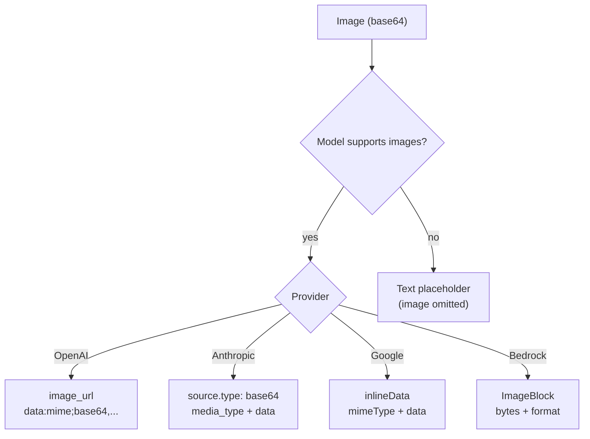

# Image Handling

## Two image surfaces

go-ai has two image-related surfaces:

1. **Multimodal text/chat inputs** — send images as message content blocks to vision-capable chat models via `Stream`/`Complete`.
2. **Image generation** — generate image outputs via the upstream-compatible `GenerateImages` API and image model registry.

## Sending images to the model




Images are sent as base64-encoded content blocks within user messages:

```go
import (
    "encoding/base64"
    "os"
)

// Read and encode an image
imageData, _ := os.ReadFile("screenshot.png")
b64 := base64.StdEncoding.EncodeToString(imageData)

ctx := &goai.Context{
    Messages: []goai.Message{
        {
            Role: goai.RoleUser,
            Content: []goai.ContentBlock{
                {Type: "text", Text: "What's in this image?"},
                {Type: "image", Data: b64, MimeType: "image/png"},
            },
        },
    },
}

msg, _ := goai.Complete(context.Background(), model, ctx, nil)
```

## Supported image formats

| Format | MIME type | OpenAI | Anthropic | Google | Bedrock |
|---|---|---|---|---|---|
| PNG | `image/png` | ✅ | ✅ | ✅ | ✅ |
| JPEG | `image/jpeg` | ✅ | ✅ | ✅ | ✅ |
| GIF | `image/gif` | ✅ | ✅ | ✅ | ✅ |
| WebP | `image/webp` | ✅ | ✅ | ✅ | ✅ |

## Multiple images

Send multiple images in a single message:

```go
{
    Role: goai.RoleUser,
    Content: []goai.ContentBlock{
        {Type: "text", Text: "Compare these two screenshots:"},
        {Type: "image", Data: image1B64, MimeType: "image/png"},
        {Type: "image", Data: image2B64, MimeType: "image/png"},
    },
}
```

## Images in tool results

When a tool produces images (e.g., screenshots, charts), include them in the tool result. go-ai converts them to the appropriate format per provider:

```go
// Tool result with image
ctx.Messages = append(ctx.Messages, goai.Message{
    Role:       goai.RoleToolResult,
    ToolCallID: tc.ID,
    ToolName:   tc.Name,
    Content: []goai.ContentBlock{
        {Type: "text", Text: "Screenshot captured"},
        {Type: "image", Data: screenshotB64, MimeType: "image/png"},
    },
})
```

## Provider wire formats

go-ai handles the format differences automatically:

| Provider | User images | Tool result images |
|---|---|---|
| **OpenAI** | `image_url` with data URI | Follow-up user message |
| **Anthropic** | `source.type: "base64"` | In tool result content |
| **Google** | `inlineData` | In function response (Gemini 3+) or separate user turn |
| **Bedrock** | `ImageBlock` with bytes | In tool result content |
| **Mistral** | Not supported | Not supported |

## Non-vision models

When a model doesn't support images (`model.Input` doesn't include `"image"`), go-ai's `TransformMessages()` automatically replaces image blocks with a text placeholder:

```
(image omitted: model does not support images)
```

For tool results:
```
(tool image omitted: model does not support images)
```

This means you can include images in your context even when switching between vision and non-vision models — the images are downgraded automatically. At debug log level, these downgrades are reported by `TransformMessages()`.

## Checking model vision support

```go
supportsImages := false
for _, input := range model.Input {
    if input == "image" {
        supportsImages = true
        break
    }
}
```

## Generating images

Image generation uses a separate registry/API surface that mirrors upstream `@earendil-works/pi-ai`:

```go
import (
    "context"
    "fmt"
    "log"

    goai "github.com/rcarmo/go-ai"
    _ "github.com/rcarmo/go-ai/provider/openai" // registers openrouter-images
)

func main() {
    goai.RegisterBuiltinImageModels()

    model := goai.GetImageModel(goai.ImagesProviderOpenRouter, "black-forest-labs/flux.2-flex")

    result, err := goai.GenerateImages(model, goai.ImagesContext{
        Input: []goai.ImageInput{
            {Type: "text", Text: "A tiny robot reading a book, watercolor"},
        },
    }, &goai.ImagesOptions{
        APIKey:  "...", // or OPENROUTER_API_KEY
        Context: context.Background(),
    })
    if err != nil {
        log.Fatal(err)
    }
    if result.StopReason != goai.StopReasonStop {
        log.Fatalf("image generation failed: %s", result.ErrorMessage)
    }

    for i, out := range result.Output {
        if out.Type == "image" {
            fmt.Printf("image %d: %s, %d base64 chars\n", i, out.MimeType, len(out.Data))
        }
    }
}
```

Provider/runtime failures mirror upstream JS behavior: `GenerateImages` resolves to an `AssistantImages` value with `StopReason` set to `"error"` or `"aborted"` and `ErrorMessage` populated. Check `StopReason`; do not rely solely on the Go `error` return.

### Image generation options

`ImagesOptions` supports:

- `APIKey` or `OPENROUTER_API_KEY`
- `Context` for cancellation (preferred Go field)
- `Signal` for upstream-name parity; use only when `Context` is nil
- `Timeout` or upstream-compatible `TimeoutMs`
- `MaxRetries` and `MaxRetryDelayMs`
- custom `Headers`
- `OnPayload` and `OnResponse` hooks for inspection/customization
- `HTTPClient` for tests or custom transports

### Image model registry

```go
goai.RegisterBuiltinImageModels()
models := goai.ListImageModels(goai.ImagesProviderOpenRouter)
model := goai.GetImageModel(goai.ImagesProviderOpenRouter, "black-forest-labs/flux.2-flex")
```

The current upstream registry contains 28 OpenRouter image models using `openrouter-images`.

## Image size considerations

- Most providers have a maximum image size (usually 20 MB base64-encoded)
- Large images increase token usage (OpenAI: ~85 tokens per 512×512 tile)
- Consider resizing images before encoding to control costs
- PNG screenshots compress well; photos are better as JPEG
