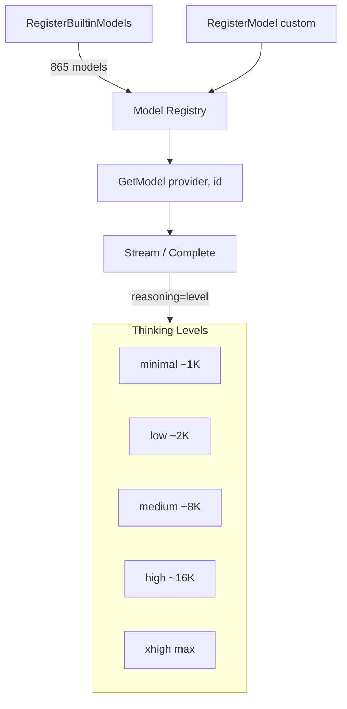

# Model & Thinking Level Selection

## Built-in model registry




go-ai ships with 865 pre-configured models across 24 providers. Register them at startup:

```go
goai.RegisterBuiltinModels()
```

Then retrieve by provider and ID:

```go
model := goai.GetModel(goai.ProviderOpenAI, "gpt-4o")
model := goai.GetModel(goai.ProviderAnthropic, "claude-sonnet-4-20250514")
model := goai.GetModel(goai.ProviderGoogle, "gemini-2.5-pro")
model := goai.GetModel(goai.ProviderMistral, "mistral-large-latest")
```

> Built-in models may use different APIs under the same provider. For example, some OpenAI models use `openai-responses` instead of `openai-completions`. Import the provider package that matches `model.Api`.

## Listing available models

```go
// All models for a provider
models := goai.ListModels(goai.ProviderOpenAI)
for _, m := range models {
    fmt.Printf("%-40s ctx=%6d reasoning=%v\n", m.ID, m.ContextWindow, m.Reasoning)
}

// All providers
for _, p := range goai.ListProviders() {
    fmt.Println(p)
}
```

## Custom models

Register models not in the built-in registry:

```go
goai.RegisterModel(&goai.Model{
    ID:            "my-custom-model",
    Name:          "My Custom Model",
    Api:           goai.ApiOpenAICompletions,
    Provider:      "my-provider",
    BaseURL:       "https://my-api.example.com/v1",
    Reasoning:     false,
    Input:         []string{"text", "image"},
    ContextWindow: 128000,
    MaxTokens:     16384,
    Cost:          goai.ModelCost{Input: 1.0, Output: 3.0},
})
```

### OpenAI-compatible APIs (Ollama, vLLM, LM Studio, etc.)

```go
goai.RegisterModel(&goai.Model{
    ID:            "llama3:latest",
    Name:          "Llama 3 (Ollama)",
    Api:           goai.ApiOpenAICompletions,   // same wire protocol
    Provider:      "ollama",
    BaseURL:       "http://localhost:11434/v1",  // Ollama's OpenAI-compatible endpoint
    Input:         []string{"text"},
    ContextWindow: 8192,
    MaxTokens:     4096,
})
```

go-ai auto-detects compatibility flags from the base URL. See `DetectCompat()` for details.

## Thinking / reasoning levels

Models that support reasoning (Claude 3.5+, GPT-o series, Gemini 2.5+, etc.) can be given a thinking level:

```go
level := goai.ThinkingMedium
opts := &goai.StreamOptions{
    Reasoning: &level,
}

msg, err := goai.Complete(ctx, model, convCtx, opts)
```

### Available levels

| Level | Token budget | Use case |
|---|---|---|
| `ThinkingMinimal` | ~1,024 | Quick factual answers |
| `ThinkingLow` | ~2,048 | Simple reasoning |
| `ThinkingMedium` | ~8,192 | Standard tasks (default) |
| `ThinkingHigh` | ~16,384 | Complex analysis |
| `ThinkingXHigh` | Provider max | Maximum depth (GPT-5.2+, Opus 4.6+ only) |

### Custom thinking budgets

Override the default token budgets per level:

```go
opts := &goai.StreamOptions{
    Reasoning: &level,
    ThinkingBudgets: &goai.ThinkingBudgets{
        Minimal: intPtr(512),
        Low:     intPtr(1024),
        Medium:  intPtr(4096),
        High:    intPtr(32768),
    },
}
```

### Checking model capabilities

```go
if model.Reasoning {
    // Model supports thinking levels
}

if goai.SupportsXhigh(model) {
    // Model supports xhigh (GPT-5.2+, Opus 4.6+)
}
```

### Streaming thinking content

When reasoning is enabled, you'll receive thinking events before text events:

```go
events := goai.Stream(ctx, model, convCtx, opts)
for event := range events {
    switch e := event.(type) {
    case *goai.ThinkingDeltaEvent:
        fmt.Fprint(os.Stderr, e.Delta) // thinking to stderr
    case *goai.TextDeltaEvent:
        fmt.Print(e.Delta) // response to stdout
    case *goai.DoneEvent:
        // Access thinking content from the message
        for _, b := range e.Message.Content {
            if b.Type == "thinking" {
                fmt.Fprintf(os.Stderr, "\n[Thinking: %d chars]\n", len(b.Thinking))
            }
        }
    }
}
```

## Switching models mid-conversation

go-ai handles cross-provider message transformation automatically:

```go
// Start with a fast model
model1 := goai.GetModel(goai.ProviderOpenAI, "gpt-4o-mini")
msg1, _ := goai.Complete(ctx, model1, convCtx, nil)
goai.AppendAssistantMessage(convCtx, msg1)

// Switch to a reasoning model for hard questions
model2 := goai.GetModel(goai.ProviderAnthropic, "claude-sonnet-4-20250514")
level := goai.ThinkingHigh
msg2, _ := goai.Complete(ctx, model2, convCtx, &goai.StreamOptions{Reasoning: &level})
```

`TransformMessages()` automatically:
- Converts thinking blocks to text when switching providers
- Strips provider-specific signatures
- Replaces images with placeholders for non-vision models
- Skips errored/aborted assistant messages
- Inserts synthetic errored tool results for orphaned tool calls

## Cost tracking

Every response includes token counts and USD costs:

```go
msg, _ := goai.Complete(ctx, model, convCtx, nil)

fmt.Printf("Input:  %d tokens ($%.6f)\n", msg.Usage.Input, msg.Usage.Cost.Input)
fmt.Printf("Output: %d tokens ($%.6f)\n", msg.Usage.Output, msg.Usage.Cost.Output)
fmt.Printf("Cache:  %d read, %d write\n", msg.Usage.CacheRead, msg.Usage.CacheWrite)
fmt.Printf("Total:  %d tokens ($%.6f)\n", msg.Usage.TotalTokens, msg.Usage.Cost.Total)

// Compute cost manually for a different model
cost := goai.CalculateCost(otherModel, msg.Usage)
```

## Comparing models

```go
if goai.ModelsAreEqual(modelA, modelB) {
    // Same provider + ID
}
```
