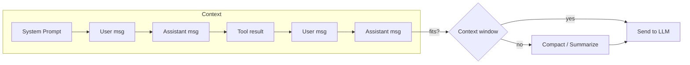

# Prompts & Context

## Context structure

A `Context` holds everything sent to the model on each request:

```go
type Context struct {
    SystemPrompt string    // instructions for the model
    Messages     []Message // conversation history
    Tools        []Tool    // available function definitions
}
```

## System prompts

The system prompt sets the model's behavior. It's sent with every request but not stored as a message:

```go
ctx := &goai.Context{
    SystemPrompt: `You are a senior Go developer.
You write clean, idiomatic code with proper error handling.
Always include comments explaining your reasoning.`,
}
```

### Dynamic system prompts

Update the system prompt between turns for context-aware behavior:

```go
ctx.SystemPrompt = fmt.Sprintf(`You are helping user %s.
Current time: %s
Available files: %s`,
    userName, time.Now().Format(time.RFC3339), strings.Join(files, ", "))
```

## Messages

Messages form the conversation history. There are three roles:

### User messages

```go
// Simple text
goai.AppendUserMessage(ctx, "Explain this error")

// Or construct directly
ctx.Messages = append(ctx.Messages, goai.UserMessage("What does this code do?"))
```

### Assistant messages

Added automatically from model responses:

```go
msg, _ := goai.Complete(background, model, ctx, nil)
goai.AppendAssistantMessage(ctx, msg)
```

### Tool result messages

Added after executing a tool call:

```go
goai.AppendToolResult(ctx, toolCall.ID, toolCall.Name, "result text", false)

// Error results
goai.AppendToolResult(ctx, toolCall.ID, toolCall.Name, "file not found", true)
```

## Multi-turn conversations




Build up a conversation by appending messages after each turn:

```go
ctx := &goai.Context{
    SystemPrompt: "You are a helpful assistant.",
}

// Turn 1
goai.AppendUserMessage(ctx, "What is Go?")
msg1, _ := goai.Complete(background, model, ctx, nil)
goai.AppendAssistantMessage(ctx, msg1)

// Turn 2 — model sees the full history
goai.AppendUserMessage(ctx, "How does it compare to Rust?")
msg2, _ := goai.Complete(background, model, ctx, nil)
goai.AppendAssistantMessage(ctx, msg2)
```

## Context inspection

```go
// Get all text from a message
text := goai.GetTextContent(msg)

// Check for tool calls
if goai.HasToolCalls(msg) {
    calls := goai.GetToolCalls(msg)
}

// Check if another LLM turn is needed
if goai.NeedsToolExecution(msg) {
    // execute tools, then call Complete() again
}
```

## Context cloning

Clone a context for branching conversations or safe concurrent access:

```go
// Deep copy — mutations don't affect the original
snapshot := goai.CloneContext(ctx)
```

## Context persistence

Save and load contexts as JSON:

```go
// Save
goai.SaveContext(ctx, "conversation.json")

// Load
restored, err := goai.LoadContext("conversation.json")
```

The JSON format is compatible with pi-ai (TypeScript), enabling cross-language context hand-off.

## Token estimation

Rough estimate for context window management:

```go
tokens := goai.EstimateTokens(ctx)

fits, tokens := goai.FitsInContextWindow(ctx, model)
if !fits {
    // need to compact
}
```

The estimate uses ~4 characters per token. For precise counts, use a provider-specific tokenizer.

## Context compaction

When context grows beyond the model's context window:

```go
// Simple: keep the last N messages
ctx = goai.CompactContext(ctx, model, 20)
```

For smarter compaction (summarization, priority-based pruning), see [Context Hooks](context-hooks.md) and [Building Agent Harnesses](HARNESS.md).

## Message content blocks

Each message contains `ContentBlock` entries. A single assistant message can contain multiple blocks:

```go
for _, block := range msg.Content {
    switch block.Type {
    case "text":
        fmt.Println(block.Text)
    case "thinking":
        fmt.Println("[Thinking]", block.Thinking)
    case "toolCall":
        fmt.Printf("Call: %s(%v)\n", block.Name, block.Arguments)
    case "image":
        fmt.Printf("Image: %s (%d bytes)\n", block.MimeType, len(block.Data))
    }
}
```

## Stop reasons

Every assistant message has a `StopReason`:

| Reason | Meaning |
|---|---|
| `StopReasonStop` | Model finished naturally |
| `StopReasonLength` | Hit max tokens |
| `StopReasonToolUse` | Model wants to call tools |
| `StopReasonError` | Provider error |
| `StopReasonAborted` | Request was cancelled |
