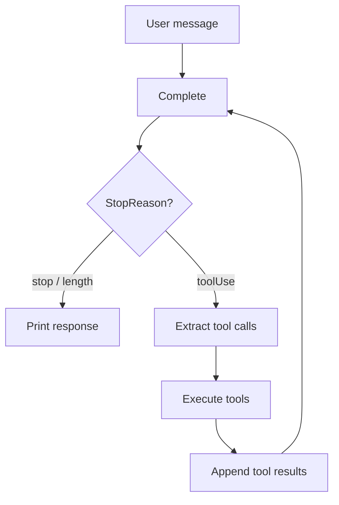

# Tool Calling

## Defining tools

Tools are defined with a name, description, and JSON Schema parameters:

```go
tools := []goai.Tool{
    {
        Name:        "read_file",
        Description: "Read the contents of a file",
        Parameters:  json.RawMessage(`{
            "type": "object",
            "properties": {
                "path": {
                    "type": "string",
                    "description": "Absolute or relative file path"
                }
            },
            "required": ["path"]
        }`),
    },
    {
        Name:        "search",
        Description: "Search the web for information",
        Parameters:  json.RawMessage(`{
            "type": "object",
            "properties": {
                "query": {
                    "type": "string",
                    "description": "Search query"
                },
                "limit": {
                    "type": "integer",
                    "description": "Max results (default 5)"
                }
            },
            "required": ["query"]
        }`),
    },
}
```

Pass tools in the context:

```go
ctx := &goai.Context{
    SystemPrompt: "You are an assistant with file and search access.",
    Messages:     []goai.Message{goai.UserMessage("Read the README.md file")},
    Tools:        tools,
}
```

## The agent loop pattern




When the model wants to call a tool, it returns `StopReasonToolUse`. You execute the tool and feed the result back:

```go
for {
    msg, err := goai.Complete(context.Background(), model, ctx, nil)
    if err != nil {
        log.Fatal(err)
    }
    goai.AppendAssistantMessage(ctx, msg)

    if !goai.NeedsToolExecution(msg) {
        // Model is done — print final response
        fmt.Println(goai.GetTextContent(msg))
        break
    }

    // Execute each tool call
    for _, tc := range goai.GetToolCalls(msg) {
        result, isError := executeTool(tc)
        goai.AppendToolResult(ctx, tc.ID, tc.Name, result, isError)
    }
    // Loop back — model sees tool results and continues
}
```

## Extracting tool calls

```go
calls := goai.GetToolCalls(msg)
for _, tc := range calls {
    fmt.Printf("Tool: %s\n", tc.Name)
    fmt.Printf("  ID: %s\n", tc.ID)
    fmt.Printf("  Args: %v\n", tc.Arguments)
}
```

Arguments are `map[string]interface{}` — parse them into your types:

```go
path, ok := tc.Arguments["path"].(string)
if !ok {
    goai.AppendToolResult(ctx, tc.ID, tc.Name, "missing 'path' argument", true)
    continue
}
```

## Argument validation

Validate arguments against the tool's JSON Schema:

```go
args, err := goai.ValidateToolCall(tools, tc)
if err != nil {
    goai.AppendToolResult(ctx, tc.ID, tc.Name, err.Error(), true)
    continue
}
```

`ValidateToolCall` checks:
- Tool exists
- Required fields are present
- Field types match schema (string, number, boolean, array, object)
- Enum values are valid

## Returning tool results

### Text results

```go
goai.AppendToolResult(ctx, tc.ID, tc.Name, "File contents here...", false)
```

### Error results

```go
goai.AppendToolResult(ctx, tc.ID, tc.Name, "Error: file not found", true)
```

### Structured results

For complex results, serialize to JSON:

```go
result := map[string]interface{}{
    "status": "success",
    "data":   searchResults,
    "count":  len(searchResults),
}
resultJSON, _ := json.Marshal(result)
goai.AppendToolResult(ctx, tc.ID, tc.Name, string(resultJSON), false)
```

## Multiple tool calls per turn

Models can request multiple tool calls in a single response. Execute all of them before the next LLM turn:

```go
calls := goai.GetToolCalls(msg)
for _, tc := range calls {
    result, isError := executeTool(tc)
    goai.AppendToolResult(ctx, tc.ID, tc.Name, result, isError)
}
```

### Parallel execution

For independent tools, execute concurrently:

```go
calls := goai.GetToolCalls(msg)
type toolResult struct {
    id, name, result string
    isError          bool
}
results := make(chan toolResult, len(calls))

for _, tc := range calls {
    go func(tc goai.ToolCall) {
        result, isError := executeTool(tc)
        results <- toolResult{tc.ID, tc.Name, result, isError}
    }(tc)
}

for range calls {
    r := <-results
    goai.AppendToolResult(ctx, r.id, r.name, r.result, r.isError)
}
```

## Streaming tool calls

During streaming, tool call arguments arrive incrementally:

```go
events := goai.Stream(ctx, model, convCtx, nil)
for event := range events {
    switch e := event.(type) {
    case *goai.ToolCallStartEvent:
        fmt.Printf("Tool call starting: %s\n", e.Partial.Content[e.ContentIndex].Name)

    case *goai.ToolCallDeltaEvent:
        // Partial JSON — useful for showing progress
        fmt.Printf("  args chunk: %s\n", e.Delta)

    case *goai.ToolCallEndEvent:
        // Final parsed arguments
        fmt.Printf("  final: %s(%v)\n", e.ToolCall.Name, e.ToolCall.Arguments)
    }
}
```

## Cross-provider tool call IDs

Different providers use different ID formats. go-ai normalizes them automatically via `TransformMessages()`. OpenAI Responses API uses `callId|itemId` format; Anthropic uses `toolu_xxx`. When switching providers mid-conversation, IDs are normalized transparently.

## Dynamic tools

Change available tools between turns:

```go
// Start with basic tools
ctx.Tools = basicTools

msg1, _ := goai.Complete(bg, model, ctx, nil)
goai.AppendAssistantMessage(ctx, msg1)

// Add more tools after initial assessment
ctx.Tools = append(basicTools, advancedTools...)

msg2, _ := goai.Complete(bg, model, ctx, nil)
```

## Testing tool calling with faux

```go
import "github.com/rcarmo/go-ai/provider/faux"

reg := faux.Register(nil)
reg.SetResponses([]faux.ResponseStep{
    faux.ToolCallMessage("search", map[string]interface{}{"query": "Go channels"}),
    faux.TextMessage("Based on the search results: ..."),
})

// Your agent loop runs against the faux model
// First call returns a tool call, second returns text
```
